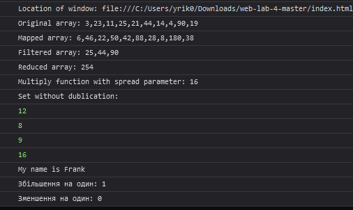

# web-lab-4

A vanilla JavaScript practice project demonstrating core language concepts through six short tasks.

## Tasks

| # | Topic | What it shows |
|---|-------|---------------|
| 1 | IIFE | Logs `window.location.href` immediately on load |
| 2 | Array methods | `map`, `filter`, and `reduce` on a numeric array |
| 3 | Spread operator | Passing array elements as function arguments |
| 4 | Set | Automatic deduplication of values |
| 5 | Function binding | Using `.bind()` to change `this` context |
| 6 | Closure counter | Object with `increment` / `decrement` methods sharing private state |

## Usage

Open `index.html` in a browser and check the developer console for output.

## Output preview

